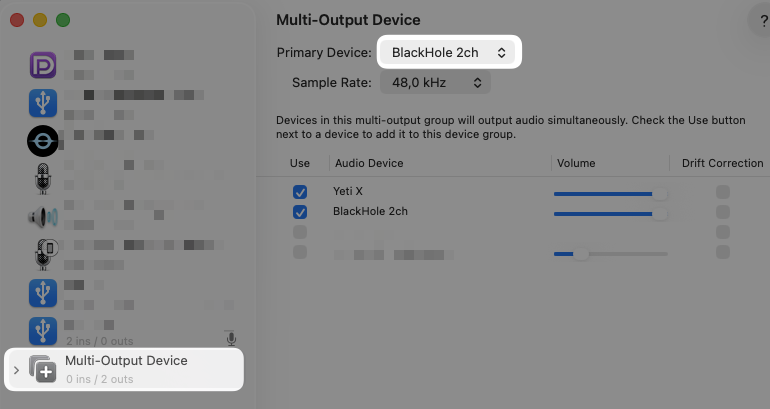
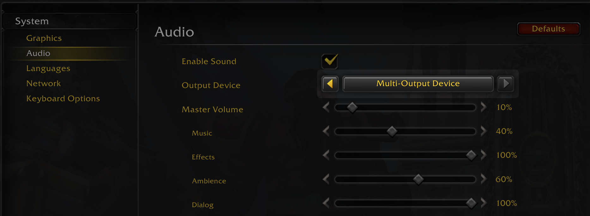

# WetFishBot v1.0.0 - OpenCV Edition
Automated fishing bot for World of Warcraft Classic that works on macOS.
Detects the fishing bobber using computer vision and audio cues.

## Disclaimer
Use at your own risk. Any 3rd party automation, including all types of botting, is against the TOS and may cause a permanent ban. The script has been made as an educational project and will not receive any further updates.

## In-game configuration
1. Install the WoW Classic Addon called [Better Fishing](https://www.curseforge.com/wow/addons/better-fishing) and enable 'Enhance Sounds' option of the addon
2. Enable Auto Loot in-game
3. Bind your 'Fishing' spell to a keyboard button
4. Bind your 'Lure' spell to a keyboard button. `LURE_COOLDOWN` is set at 10 minutes
> If you want to be able to fish up BoP items, download the [Leatrix Plus](https://www.curseforge.com/wow/addons/leatrix-plus) addon and select 'Disable loot warnings' from the System menu
5. Set the game's Audio to Multi-Audio Device
> On macOS, you must use a virtual audio device called [BlackHole](https://github.com/ExistentialAudio/BlackHole?tab=readme-ov-file#record-system-audio). The script listens to the game's sound and uses it to decide when to loot the hooked fish.
6. Use WoW in Windowed mode, zoom in to the max, and hide the UI while fishing (⌥+Z).

### BlackHole Screenshot Example

### WoW Classic Audio Settings

## Usage
### 1st time usage
0. `brew install python-tk`
> Tkinter is required in order to draw the fishing region on your screen and capture the coordinates of the area where the bobber should be searched for.
1. `python3 -m venv .venv`
2. `source .venv/bin/activate`
3. `pip3 install -r requirements.txt`
4. `python3 splash.py`

- running the script on macOS for the 1st time it will ask for various authorisations. Provide them all via 'System Settings -> Privacy & Security'
> ⚠️ the script needs to be able to take screenshots of your game and to listen to your audio driver in order to detect the bobber, move the mouse to its location and click it when the fish hooks.

### Any other time
1. `source .venv/bin/activate`
2. `python3 splash.py`

## FAQ
1. My bobber is not detected
- Use your own bobber images, add them to the `images` folder
> make sure they are .png files
